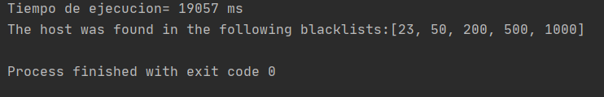
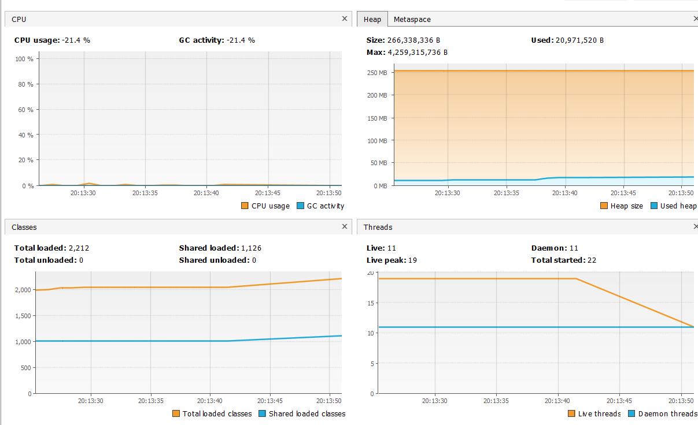
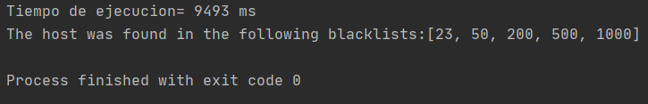
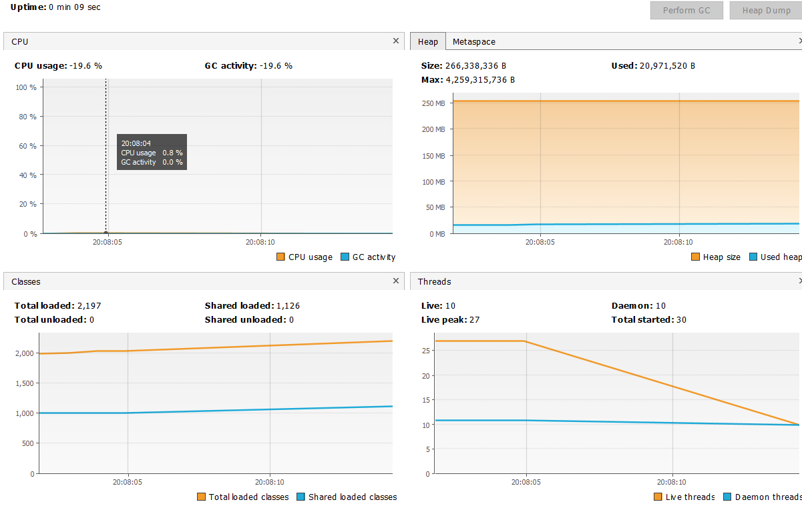
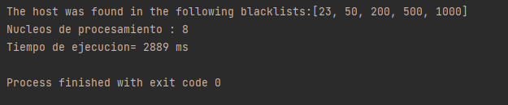
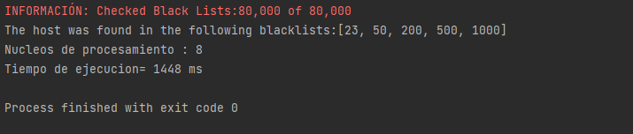
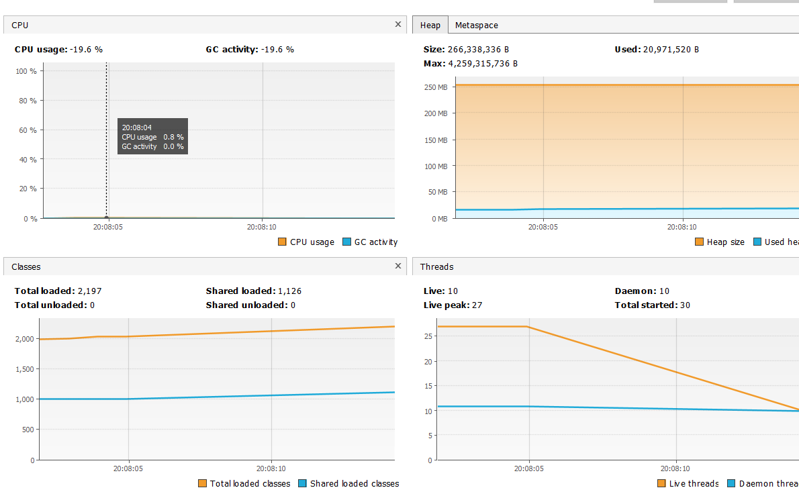
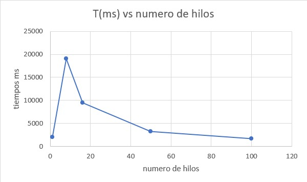

### Escuela Colombiana de Ingeniería
### Arquitecturas de Software - ARSW Lab1
## Ejercicio Introducción al paralelismo - Hilos - Caso BlackListSearch


### Introduccion 🚀
	El objetivo de este laboratorio es trabajar y entender los Threads(subprocesos) con dos ejercicios que son: crear 3 hilos 
	y que cada uno imprima un segmento distinto de números y buscar trabajar con un problema relacionado con listas negras
	buscando su solucion Usando hilos. Este proyecto se desarrolla con fines académicos.
  

- ### Compilación y ejecución  📋
primero debemos tener una copia local del repositorio puede usar el comando `git clone`.

para compilarlo, el repositorio local, desde consola, nos ubicamos en la raiz del proyecto y usamos el comando `mvn compile`.
Para la ejecucion basta con el comando `mvn exec:java -Dexec.mainClass="edu.eci.arsw.threads.CountThreadsMain` desde consola. para algún resultado en especifico debera alterar la fuente.

- ## solucion a preguntas 🔧
	#### parte I - Introducción a Hilos en Java
	Cambie el incio con 'start()' por 'run()'. Cómo cambia la salida?, por qué?.
	
	en la salida con `run()` se mostraban los segmentos en orden y en el orden que se ejecuta cada en el código, por otro lado cuando usamos `start()` se ejecuto en desorden y se mostraba la parte de un segmento después la de otro y así sucesivamente, esto por la disponibilidad del medio en procesos paralelos.
	
	
	**Parte II - Ejercicio Black List Search**


	Para un software de vigilancia automática de seguridad informática se está desarrollando un componente encargado de validar las direcciones IP en varios miles de listas negras (de host maliciosos) conocidas, y reportar aquellas que existan en al menos cinco de dichas listas. 

	Dicho componente está diseñado de acuerdo con el siguiente diagrama, donde:

	- HostBlackListsDataSourceFacade es una clase que ofrece una 'fachada' para realizar consultas en cualquiera de las N listas negras registradas (método 'isInBlacklistServer'), y que permite también hacer un reporte a una base de datos local de cuando una dirección IP se considera peligrosa. Esta clase NO ES MODIFICABLE, pero se sabe que es 'Thread-Safe'.

	- HostBlackListsValidator es una clase que ofrece el método 'checkHost', el cual, a través de la clase 'HostBlackListDataSourceFacade', valida en cada una de las listas negras un host determinado. En dicho método está considerada la política de que al encontrarse un HOST en al menos cinco listas negras, el mismo será registrado como 'no confiable', o como 'confiable' en caso contrario. Adicionalmente, retornará la lista de los números de las 'listas negras' en donde se encontró registrado el HOST.

	

	Al usarse el módulo, la evidencia de que se hizo el registro como 'confiable' o 'no confiable' se dá por lo mensajes de LOGs:

	INFO: HOST 205.24.34.55 Reported as trustworthy

	INFO: HOST 205.24.34.55 Reported as NOT trustworthy


	Al programa de prueba provisto (Main), le toma sólo algunos segundos análizar y reportar la dirección provista (200.24.34.55), ya que la misma está registrada más de cinco veces en los primeros servidores, por lo que no requiere recorrerlos todos. Sin embargo, hacer la búsqueda en casos donde NO hay reportes, o donde los mismos están dispersos en las miles de listas negras, toma bastante tiempo.

	Éste, como cualquier método de búsqueda, puede verse como un problema [vergonzosamente paralelo](https://en.wikipedia.org/wiki/Embarrassingly_parallel), ya que no existen dependencias entre una partición del problema y otra.

	Para 'refactorizar' este código, y hacer que explote la capacidad multi-núcleo de la CPU del equipo, realice lo siguiente:

	1. Cree una clase de tipo Thread que represente el ciclo de vida de un hilo que haga la búsqueda de un segmento del conjunto de servidores disponibles. Agregue a dicha clase un método que permita 'preguntarle' a las instancias del mismo (los hilos) cuantas ocurrencias de servidores maliciosos ha encontrado o encontró.

	``` java
	public class ThreadBlackList extends Thread {
	    private static final int BLACK_LIST_ALARM_COUNT=5;
	    private int a,b,ocurrences;
	    private String Host;
	    LinkedList<Integer> blackListOcurrences=new LinkedList<>();
	    private int checkedListsCount;
	    private int ocurrencesCount;
	    HostBlacklistsDataSourceFacade skds=HostBlacklistsDataSourceFacade.getInstance();
	    public ThreadBlackList(int a , int b, String Host){
		this.a=a;
		this.b=b;
		this.Host=Host;
		this.checkedListsCount=0;
		this.ocurrencesCount=0;
	    }
	    public void run() {
		for ( int i = a; i < b && ocurrencesCount < BLACK_LIST_ALARM_COUNT; i++ ) {
		    checkedListsCount++;
		    if ( skds.isInBlackListServer( i, Host ) ) {
			blackListOcurrences.add( i );
			ocurrencesCount++;
		    }
		}
	    }
	    public LinkedList<Integer> getBlackListOcurrences(){
		    return blackListOcurrences;
	    }
	    public  int getOcurrencesCount(){
		    return ocurrencesCount;
	    }
	    public  int getCheckedListsCount(){
		return checkedListsCount;
	    }
	}

	```

	2. Agregue al método 'checkHost' un parámetro entero N, correspondiente al número de hilos entre los que se va a realizar la búsqueda (recuerde tener en cuenta si N es par o impar!). Modifique el código de este método para que divida el espacio de búsqueda entre las N partes indicadas, y paralelice la búsqueda a través de N hilos. Haga que dicha función espere hasta que los N hilos terminen de resolver su respectivo sub-problema, agregue las ocurrencias encontradas por cada hilo a la lista que retorna el método, y entonces calcule (sumando el total de ocurrencuas encontradas por cada hilo) si el número de ocurrencias es mayor o igual a _BLACK_LIST_ALARM_COUNT_. Si se da este caso, al final se DEBE reportar el host como confiable o no confiable, y mostrar el listado con los números de las listas negras respectivas. Para lograr este comportamiento de 'espera' revise el método [join](https://docs.oracle.com/javase/tutorial/essential/concurrency/join.html) del API de concurrencia de Java. Tenga también en cuenta:

		* Dentro del método checkHost Se debe mantener el LOG que informa, antes de retornar el resultado, el número de listas negras revisadas VS. el número de listas negras total (línea 60). Se debe garantizar que dicha información sea verídica bajo el nuevo esquema de procesamiento en paralelo planteado.

		* Se sabe que el HOST 202.24.34.55 está reportado en listas negras de una forma más dispersa, y que el host 212.24.24.55 NO está en ninguna lista negra.
	```java
	    public List<Integer> checkHost(String ipaddress, int N) throws InterruptedException {

		LinkedList<Integer> blackListOcurrences=new LinkedList<>();
		int ocurrencesCount=0;
		HostBlacklistsDataSourceFacade skds=HostBlacklistsDataSourceFacade.getInstance();
		int checkedListsCount=0;
		System.out.println(skds.getRegisteredServersCount() );
		int num = skds.getRegisteredServersCount()/N;
		int mod = skds.getRegisteredServersCount()%N;
		LinkedList<ThreadBlackList> threadList=new LinkedList<>();

		for(int i=0;i<N-1;i++){
		    ThreadBlackList hilo = new ThreadBlackList( (i*num),(i*num)+num,ipaddress );
		    hilo.start();
		    threadList.add(hilo);
		}
		ThreadBlackList hilo = new ThreadBlackList( (N-1)*num,skds.getRegisteredServersCount(),ipaddress );
		hilo.start();
		threadList.add(hilo);

		for(ThreadBlackList tl:threadList ){
		    tl.join();
		}


		for(ThreadBlackList tl:threadList ){
		    ocurrencesCount += tl.getOcurrencesCount();
		    checkedListsCount += tl.getCheckedListsCount();
		    blackListOcurrences.addAll(tl.getBlackListOcurrences());
		}
		if (ocurrencesCount>=BLACK_LIST_ALARM_COUNT){
		    skds.reportAsNotTrustworthy(ipaddress);
		}
		else{
		    skds.reportAsTrustworthy(ipaddress);
		}                

		LOG.log(Level.INFO, "Checked Black Lists:{0} of {1}", new Object[]{checkedListsCount, skds.getRegisteredServersCount()});

		return blackListOcurrences;
	    }
	```


	**Parte II.I Para discutir la próxima clase (NO para implementar aún)**

	La estrategia de paralelismo antes implementada es ineficiente en ciertos casos, pues la búsqueda se sigue realizando aún cuando los N hilos (en su conjunto) ya hayan encontrado el número mínimo de ocurrencias requeridas para reportar al servidor como malicioso. Cómo se podría modificar la implementación para minimizar el número de consultas en estos casos?, qué elemento nuevo traería esto al problema?

	**Parte III - Evaluación de Desempeño**

	A partir de lo anterior, implemente la siguiente secuencia de experimentos para realizar las validación de direcciones IP dispersas (por ejemplo 202.24.34.55), tomando los tiempos de ejecución de los mismos (asegúrese de hacerlos en la misma máquina):

	1. Un solo hilo.
	
	
	2. Tantos hilos como núcleos de procesamiento (haga que el programa determine esto haciendo uso del [API Runtime](https://docs.oracle.com/javase/7/docs/api/java/lang/Runtime.html)).
	
	
	3. Tantos hilos como el doble de núcleos de procesamiento.
	
	
	4. 50 hilos.
	
	
	5. 100 hilos.
	
	


	Con lo anterior, y con los tiempos de ejecución dados, haga una gráfica de tiempo de solución vs. número de hilos. Analice y plantee hipótesis con su compañero para las siguientes preguntas (puede tener en cuenta lo reportado por jVisualVM):

	
	

	**Parte IV - Ejercicio Black List Search**

	1. Según la [ley de Amdahls](https://www.pugetsystems.com/labs/articles/Estimating-CPU-Performance-using-Amdahls-Law-619/#WhatisAmdahlsLaw?):

	, donde _S(n)_ es el mejoramiento teórico del desempeño, _P_ la fracción paralelizable del algoritmo, y _n_ el número de hilos, a mayor _n_, mayor debería ser dicha mejora. Por qué el mejor desempeño no se logra con los 500 hilos?, cómo se compara este desempeño cuando se usan 200?. 

		* No se logra ya que porque no es fisicamente eficiente no existen los nucleos para ejecutar cada hilo y no se puede cumplir la ley de amdahls en el que no se puede paralelizar más el algoritmo y comienza a tener un desempeño constante.


	2. Cómo se comporta la solución usando tantos hilos de procesamiento como núcleos comparado con el resultado de usar el doble de éste?.

		* En nuestro caso, con la maquina que usamos se redujo el tiempo casi a la mitad usando el doble de hilos al numero de nucleos.

	3. De acuerdo con lo anterior, si para este problema en lugar de 100 hilos en una sola CPU se pudiera usar 1 hilo en cada una de 100 máquinas hipotéticas, la ley de Amdahls se aplicaría mejor?. Si en lugar de esto se usaran c hilos en 100/c máquinas distribuidas (siendo c es el número de núcleos de dichas máquinas), se mejoraría?. Explique su respuesta.

		* Si, se aplicaria mejor se aprovecharia los beneficios de la paralelizacion deberia ser un resultado similar, aunque esto ignorando mas aspectos.

## Autores ✒️
* [Johan Damian Garrido Florez](https://github.com/anamariasalazar)
* [Posso Guevara Juan Camilo](https://github.com/RichardUG)

## Licencia 📄

Licencia bajo la [GNU General Public License](/LICENSE)
